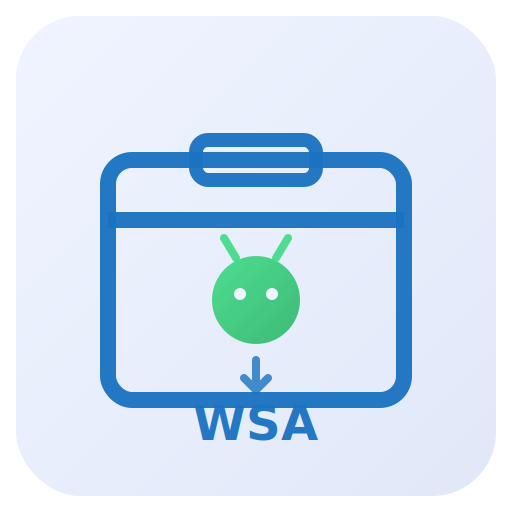
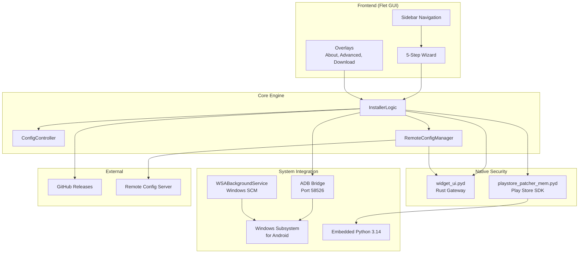
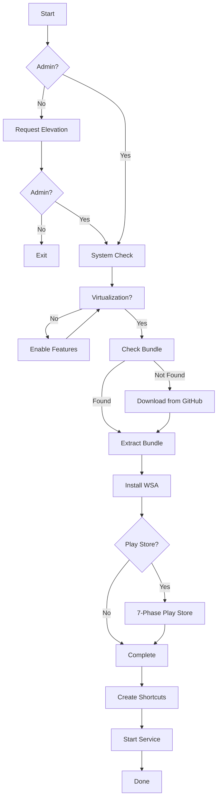

<div align="center">

<picture>
  <source media="(prefers-color-scheme: dark)" srcset="assets/logo-dark.svg">
  <source media="(prefers-color-scheme: light)" srcset="assets/logo-light.svg">
  
</picture>

# WSA Installer

### The Modern Windows Subsystem for Android Installation & Management Toolkit


**A complete solution for installing Windows Subsystem for Android with Google Play Store on Windows 10/11.**

Built with care by [AT Tech Zone](https://www.youtube.com/@AT_Tech_Zone) — MR CYBER

[Download WSA Installer (228 MB)](https://github.com/WSA-Installer/wsa-installer/releases/latest) · [Download Bundle (1.21 GB)](https://github.com/WSA-Installer/wsa-installer/releases/latest)

</div>

---

## Table of Contents

- [Introduction](#introduction)
- [Features](#features)
- [System Requirements](#system-requirements)
- [Installation](#installation)
- [The WSA Bundle](#the-wsa-bundle)
- [Architecture](#architecture)
- [CLI Reference](#cli-reference)
- [WSA WebDev — Android WebDAV Server](#wsa-webdev--android-webdav-server)
- [Configuration](#configuration)
- [Troubleshooting](#troubleshooting)
- [Build from Source](#build-from-source)
- [Tech Stack](#tech-stack)
- [Roadmap](#roadmap)
- [Contributing](#contributing)
- [Credits](#credits)
- [License](#license)
- [Support](#support)

---

## Introduction

**WSA Installer** is a professional-grade, open-source tool that automates the entire process of installing **Windows Subsystem for Android (WSA)** with or without **Google Play Store** on Windows 10 and Windows 11.

Installing WSA manually involves downloading large archives, extracting them with specific tools, configuring Windows features, patching settings files, and optionally integrating Google Apps — a process that can take hours and requires technical expertise. WSA Installer eliminates all of that complexity with a **one-click installation experience**.

### What WSA Installer Does

| Capability | Description |
|:-----------|:------------|
| **System Detection** | Automatically scans your system for VT-x/AMD-V virtualization, Hyper-V, VirtualMachinePlatform, HypervisorPlatform, and WSL support |
| **Feature Enabling** | Enables all required Windows features automatically with administrator privileges |
| **WSA Download** | Downloads the correct WSA build from GitHub Releases with parallel chunked downloads and resume support |
| **WSA Installation** | Extracts, configures, and registers the Android subsystem with proper Developer Mode settings |
| **Play Store Integration** | Patches Google Apps (MindTheGapps 13.0) onto the WSA installation with automated ADB authorization |
| **WSAPatch Fix** | Applies binary patches to `WsaClient.exe` for Windows 10 compatibility (crash fix) |
| **Background Service** | Installs `WSABackgroundService` — a Windows Service that monitors WSA status and manages the Play Store SDK |
| **Self-Update** | Checks the server for updates and installs them silently without user intervention |
| **Uninstall** | Provides complete WSA removal including services, files, and registry entries |

### Who Is This For?

- **End Users** who want to run Android apps on Windows without technical knowledge
- **Developers** who need Android emulation for testing
- **Power Users** who want a clean, automated WSA setup with Play Store
- **Anyone** who wants to avoid the complexity of manual WSA installation

---

## Features

### Core Features

| Feature | Description |
|:--------|:------------|
| Smart System Scan | Detects VT-x, Hyper-V, VirtualMachinePlatform, HypervisorPlatform, WSL in real-time |
| Auto Configuration | Enables required Windows features automatically with admin privileges |
| One-Click Install | Handles download, extraction, and setup end-to-end |
| Play Store Patching | Applies Run.bat, WsaClient.exe, ps.ico patches automatically via Rust SDK |
| WSAPatch Fix | Binary patches WsaClient.exe for compatibility on Windows 10 |
| Background Service | `WSABackgroundService` monitors WSA status and manages the SDK |
| Self-Update | Checks server for updates and installs silently |
| Developer Mode | Enabled automatically for advanced usage and ADB access |

### Installer Features

| Feature | Description |
|:--------|:------------|
| NSIS Professional Setup | Industry-standard Windows installer with wizard UI |
| Silent Mode | Full `/S` silent install support for automation |
| Maintenance Mode | Repair, reinstall, or uninstall from existing installation |
| UAC Elevation | Automatic administrator privilege request |
| Single Instance | Mutex-based prevents running multiple installer copies |
| Windows 10 Check | Validates minimum OS build before installation |

### UI Features

| Feature | Description |
|:--------|:------------|
| Flet-Based GUI | Modern cross-platform UI framework |
| Glass Transparency | Alpha-blended window transparency (configurable 0-100) |
| 5-Step Wizard | Guided installation flow: Intro → Check → Install → Play Store → Complete |
| Real-Time Progress | Live download progress with speed and ETA |
| Remote Config | Server-side configuration updates without app changes |

### Developer Features

| Feature | Description |
|:--------|:------------|
| Source Protection | Nuitka compilation + PyInstaller bundling |
| Rust Native Modules | `widget_ui.pyd` (security gateway) + `playstore_patcher_mem.pyd` (SDK) |
| Embedded Python 3.14 | Self-contained runtime for Play Store patcher |
| Activity Logging | Session-based logging to `wsa_activity.log` |
| Config Controller | Source-tracked configuration (default → dev → server) |

---

## System Requirements

| Requirement | Minimum | Recommended |
|:------------|:--------|:------------|
| OS | Windows 10 (build 19041+) or Windows 11 | Windows 11 22H2+ |
| RAM | 8 GB | 16 GB |
| Disk Space | 10 GB free | SSD with 20 GB free |
| Internet | Required for initial download only | Broadband recommended |
| Privileges | Administrator | Administrator |
| Virtualization | Enabled in BIOS/UEFI | Intel VT-x or AMD-V |

### Windows Features Required

| Feature | Status | How Installer Handles It |
|:--------|:-------|:-------------------------|
| Hyper-V | Must be enabled | Auto-enabled by installer |
| VirtualMachinePlatform | Must be enabled | Auto-enabled by installer |
| HypervisorPlatform | Must be enabled | Auto-enabled by installer |
| Windows Subsystem for Linux | Must be enabled | Auto-enabled by installer |

---

## Installation

### Step 1 — Download

Download the WSA Installer setup file from the official release:

| File | Size | Link |
|:-----|:-----|:-----|
| `WSA_Installer_Setup.exe` | 228 MB | [Download](https://github.com/WSA-Installer/wsa-installer/releases/latest) |
| `bundle.wsa` (optional) | 1.21 GB | [Download](https://github.com/WSA-Installer/wsa-installer/releases/latest) |

> **Note:** The `bundle.wsa` file is optional. If not provided, the installer will download WSA packages directly from GitHub during installation.

### Step 2 — Run Installer

1. Right-click `WSA_Installer_Setup.exe` and select **Run as administrator**
2. Accept the UAC (User Account Control) prompt
3. The installer wizard will launch with the Welcome page

**Silent Install (Advanced):**
```cmd
WSA_Installer_Setup.exe /S
```

### Step 3 — System Check

The installer automatically scans your system for:

- **Virtualization Support** — Intel VT-x or AMD-V (detected via 5 methods: CPUID, wmic, systeminfo, PowerShell, registry)
- **Hyper-V** — Microsoft's hardware virtualization
- **VirtualMachinePlatform** — Required for WSA
- **HypervisorPlatform** — Hypervisor interface
- **WSL** — Windows Subsystem for Linux

If any required features are missing, the installer will offer to enable them automatically.

### Step 4 — Install WSA

The installer proceeds through 6 phases:

| Phase | Action |
|:------|:-------|
| 1. Locate | Finds WSA package (from bundle or GitHub download) |
| 2. Verify | Validates archive integrity and checksum |
| 3. Prepare | Extracts 7z archive, copies files to installation directory |
| 4. Patch | Applies Developer Mode settings, registry fixes, WsaClient patches |
| 5. Run | Registers WSA with Windows, starts the subsystem |
| 6. Finalize | Creates shortcuts, configures background service |

### Step 5 — Add Play Store

If you selected the Play Store option, the installer proceeds through 7 additional phases:

| Phase | Action |
|:------|:-------|
| 1. Locate | Finds GApps package (MindTheGapps 13.0) |
| 2. Verify | Validates GApps archive |
| 3. Extract | Extracts GApps to temporary directory |
| 4. Patch | Runs MagiskOnWSALocal patching (Run.bat + patches) |
| 5. ADB | Automates ADB authorization via pywinauto GUI automation |
| 6. Install | Pushes GApps to WSA via ADB |
| 7. Finalize | Applies Play Store icon, cleans up, restarts WSA |

### Step 6 — Complete

Once installation is complete:

- **Play Store** shortcut appears in Start Menu
- **Windows Subsystem for Android** shortcut appears on Desktop
- **WSABackgroundService** is running and monitoring WSA status
- You can now launch Android apps directly from the Start Menu

---

## The WSA Bundle

### Overview

The WSA Bundle (`bundle.wsa`) is a **pre-packaged archive** that combines both the WSA Basic package and the WSA + Google Play Store package into a single downloadable asset.

### What's Included

#### 1. Base Package (WSA Basic)

| Component | Version / Notes |
|:----------|:----------------|
| WSA Build | 2407.40000.4.0 |
| Channel | Nightly Release |
| Architecture | x64 |
| Google Play Store | Not included |
| Amazon Appstore | Not included |

#### 2. Play Store Package (WSA + GApps)

| Component | Version / Notes |
|:----------|:----------------|
| WSA Build | 2407.40000.4.0 |
| Channel | Nightly Release |
| Architecture | x64 |
| Google Play Store | Included (MindTheGapps 13.0) |
| Amazon Appstore | Not included |

> Both packages are based on the official WSABuilds release from [MustardChef/WSABuilds](https://github.com/MustardChef/WSABuilds).

### Why a Bundle?

| Benefit | Description |
|:--------|:------------|
| Single download | One file instead of two |
| Faster install | Reduced overall installation time |
| Offline access | Both packages remain available offline |
| No redundancy | No redundant network requests |

---

## Architecture

### Application Architecture



### Security Architecture

```
┌──────────────────────────────────────────────────────┐
│                  Security Layers                      │
├──────────────────────────────────────────────────────┤
│                                                      │
│  Layer 1: widget_ui.pyd (Rust)                      │
│  ├── Zero-trust config gateway                      │
│  ├── Signature verification                         │
│  └── Encrypted config parsing                       │
│                                                      │
│  Layer 2: Socket-based Instance Locks               │
│  ├── Single instance enforcement                    │
│  └── Port-based process detection                   │
│                                                      │
│  Layer 3: Windows Service                           │
│  ├── SYSTEM-level service (WSABackgroundService)    │
│  ├── Auto-restart on failure                        │
│  └── User session process spawning                  │
│                                                      │
│  Layer 4: Source Protection                         │
│  ├── Nuitka compilation (app.py → app.pyd)          │
│  ├── PyInstaller bundling                           │
│  └── Binary string obfuscation                      │
│                                                      │
└──────────────────────────────────────────────────────┘
```

### Installation Flow



---

## CLI Reference

### Command Line Arguments

| Argument | Description |
|:---------|:------------|
| `--install-service` | Install WSABackgroundService |
| `--uninstall-service` | Remove WSABackgroundService |
| `--bg-service` | Run as background service (SYSTEM context) |
| `--bg-service-gui` | Background service with visible console |
| `--uninstall` | Launch uninstall dialog |
| `--update <url> <ver>` | Self-update dialog |
| `--repair-wsa` | 4-step WSA repair (detect → stop → backup → reinstall) |
| `--file-sharing` | File sharing (WebDAV mount) dialog |
| `--ad <url> <secs>` | Spawn ad overlay |
| `--sdk` | Start Play Store patcher SDK |

### Silent Installation

```cmd
WSA_Installer_Setup.exe /S
```

### Repair from Windows Settings

```cmd
WSA_Installer_Setup.exe /S /repair
```

---

## WSA WebDev — Android WebDAV Server

The `WSA WebDev` project is a complete **Android WebDAV Server** that runs inside WSA, providing file system access from your PC's web browser.

### Features

| Feature | Description |
|:--------|:------------|
| WebDAV Protocol | Full WebDAV server (OPTIONS, GET, PUT, DELETE, MKCOL, COPY, MOVE, PROPFIND, PROPPATCH, LOCK, UNLOCK) |
| Root Access | Supports root filesystem operations via `su` |
| Web File Manager | Complete SPA with dark/light themes, grid/list views, drag-and-drop |
| ADB Commands | Remote control via ADB intents (START, STOP, RESTART, STATUS, HEALTH) |
| Auto-Start | Boot receiver for automatic startup |
| Health Monitoring | 30-second interval health checks |

> See the [wsa-webdav](https://github.com/WSA-Installer/wsa-webdav) repository for full documentation.

---

## Configuration

### Remote Configuration

The installer fetches remote JSON configuration from the server on a timer. Configuration is managed by `ConfigController` with source tracking:

```
Default Config → Dev Mode Config → Server Config
```

### Config Sources

| Source | Priority | Description |
|:-------|:---------|:------------|
| Default | 1 | Built-in application defaults |
| Dev Mode | 2 | Developer mode overrides (if enabled) |
| Server | 3 | Remote configuration updates |

### Security Gateway

The `widget_ui.pyd` Rust module provides:

- Zero-trust config parsing with signature verification
- Encrypted configuration handling
- Hash-based deduplication
- Fallback mechanisms for offline scenarios

---

## Troubleshooting

### Common Issues

| Issue | Solution |
|:------|:---------|
| Virtualization not detected | Enable VT-x/AMD-V in BIOS/UEFI |
| Hyper-V won't enable | Check if WSL2 is installed, run `bcdedit /set hypervisorlaunchtype auto` |
| Download fails | Check internet connection, try manually downloading bundle.wsa |
| Play Store not working | Ensure ADB authorization completed, check Developer Mode is enabled |
| WsaClient.exe crashes (Win10) | WSAPatch fix is applied automatically; manual patch available |
| Service won't start | Run `WSA Installer.exe --install-service` as administrator |

### Logs

- **Activity Log:** `wsa_activity.log` — Session-based activity logging
- **Application Logs:** Written to `sys.__stdout__` with `[APP LOGS]` prefix

### Manual WSA Kill

If WSA gets stuck:

```cmd
taskkill /F /IM WsaService.exe
taskkill /F /IM WsaClient.exe
taskkill /F /IM WsaSettings.exe
```

---

## Build from Source

### Prerequisites

- Python 3.14
- Node.js (for yt-dlp embedded in emb_py)
- Nuitka (`pip install nuitka`)
- PyInstaller (`pip install pyinstaller`)
- NSIS ([nsis.sourceforge.io](https://nsis.sourceforge.io))

### Primary Build

```cmd
build.bat
```

Build pipeline:

```
Step 1: Clean
    └── Removes dist/, build/, app.pyd, *.build

Step 2: Dependencies
    └── pip install -r requirements.txt

Step 3: Version Update
    └── PowerShell replaces version in app.py + file_version_info.txt

Step 4: Nuitka Module
    ├── Compiles app.py → app.pyd (module mode, source protection)
    └── Renames app.py → wsa.py to hide source

Step 5: PyInstaller Onedir
    ├── Uses WSA_Installer_Download_onedir.spec
    └── Restores app.py from wsa.py after build

Step 6: WSARepair.exe
    └── PyInstaller --onefile

Step 7: Flet Client Patch
    ├── Patches flet.exe icon + version info
    └── Creates patched flet-windows.zip

Step 8: NSIS Installer
    └── Builds WSA_Installer_Setup.exe
```

### Alternate Build

```cmd
build2.bat
```

Uses Nuitka standalone mode with C# launcher compilation.

---

## Tech Stack

### Core Technologies

| Technology | Version | Usage |
|:-----------|:--------|:------|
| Python | 3.14 | Application framework with Flet UI |
| Rust | Latest | Security gateway (`widget_ui.pyd`) and SDK (`playstore_patcher_mem.pyd`) |
| Flet | Latest | Cross-platform GUI framework |
| PyQt6 | Latest | Embedded Python runtime for Play Store patcher |

### Build Tools

| Tool | Usage |
|:-----|:------|
| Nuitka | Python to C compilation (source protection) |
| PyInstaller | Application bundling (onedir mode) |
| NSIS | Windows installer packaging |
| C# / PowerShell | Launcher compilation |

### Dependencies

| Package | Purpose |
|:--------|:--------|
| requests | HTTP client for downloads |
| flet | Cross-platform UI framework |
| pyautogui | GUI automation |
| pyperclip | Clipboard operations |
| pywinauto | Windows UI Automation (ADB authorization) |
| PyQt6 | Qt6 bindings (ads browser) |
| PyQt6-WebEngine | Chromium web engine |
| pycryptodomex | Cryptography |
| pillow | Image processing |
| comtypes | COM interface access |
| psutil | Process/system utilities |
| brotli | Compression |
| inflate64 | 64-bit inflate compression |
| multivolumefile | Multi-volume archives |
| pybcj | Blosc2 compression |
| pyppmd | PPMD compression |
| texttable | Text table formatting |
| pywin32 | Win32 API access |
| packaging | Version parsing |

### Native Modules

| Module | Language | Purpose |
|:-------|:---------|:--------|
| `widget_ui.pyd` | Rust | Zero-trust security gateway |
| `playstore_patcher_mem.pyd` | Rust | Play Store patcher SDK |

---

## Roadmap

### Current (v1.2.x)

- [x] One-click WSA installation
- [x] Play Store integration
- [x] Background service
- [x] Self-update system
- [x] Repair and uninstall flows
- [x] File sharing (WebDAV)
- [x] Glass transparency UI
- [x] Remote configuration
- [x] NSIS professional installer

### Planned

- [ ] WSA version management (install multiple versions)
- [ ] Custom GApps selection (NikGapps, FlameGApps)
- [ ] WSA settings backup and restore
- [ ] ADB shell integration in UI
- [ ] Performance monitoring dashboard
- [ ] Automatic Hyper-V configuration
- [ ] WSA app data export/import
- [ ] Multi-language support (i18n)
- [ ] Dark/light theme toggle
- [ ] Command-line batch operations
- [ ] MSI installer alternative
- [ ] Winget/Chocolatey/Scoop packages

---

## Contributing

We welcome contributions! Please see our [Contributing Guide](CONTRIBUTING.md) for details.

### Quick Start for Contributors

```bash
# 1. Fork the repository
# 2. Clone your fork
git clone https://github.com/YOUR_USERNAME/wsa-installer.git

# 3. Create a feature branch
git checkout -b feature/my-feature

# 4. Make your changes
# 5. Test with run.bat

# 6. Commit and push
git commit -m "feat(scope): add my feature"
git push origin feature/my-feature

# 7. Create a Pull Request
```

---

## Credits

### Core Projects

| Project | Maintainer | Role |
|:--------|:-----------|:-----|
| WSA Builds | [MustardChef/WSABuilds](https://github.com/MustardChef/WSABuilds) | Provides pre-built WSA archives |
| MindTheGapps | [MindTheGapps](https://mindthegapps.com) | Provides Google Apps package |
| Flet | [Flet](https://flet.dev) | Cross-platform UI framework |
| Nuitka | [Nuitka](https://nuitka.net) | Python to C compiler |
| PyInstaller | [PyInstaller](https://pyinstaller.org) | Application bundler |
| NSIS | [NSIS](https://nsis.sourceforge.io) | Windows installer system |

### Acknowledgments

- **[Microsoft](https://www.microsoft.com)** — For developing and maintaining Windows Subsystem for Android
- **[WSABuilds Community](https://github.com/MustardChef/WSABuilds)** — For providing nightly WSA builds
- **[MindTheGapps Team](https://mindthegapps.com)** — For maintaining the GApps package
- All open-source contributors whose work made this project possible

---

## License

This project is licensed under the **MIT License** — see [LICENSE](LICENSE) for details.

---

<div align="center">

### Links

[](https://www.youtube.com/@AT_Tech_Zone)
[](https://buymeacoffee.com/mrcyberdev)
[](https://github.com/WSA-Installer)

---

*Built with care by AT Tech Zone — v1.2.0.0*

</div>
