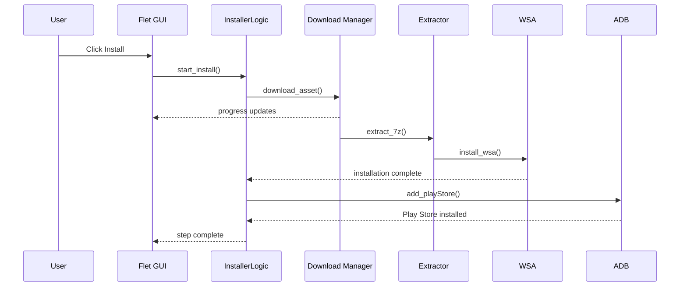
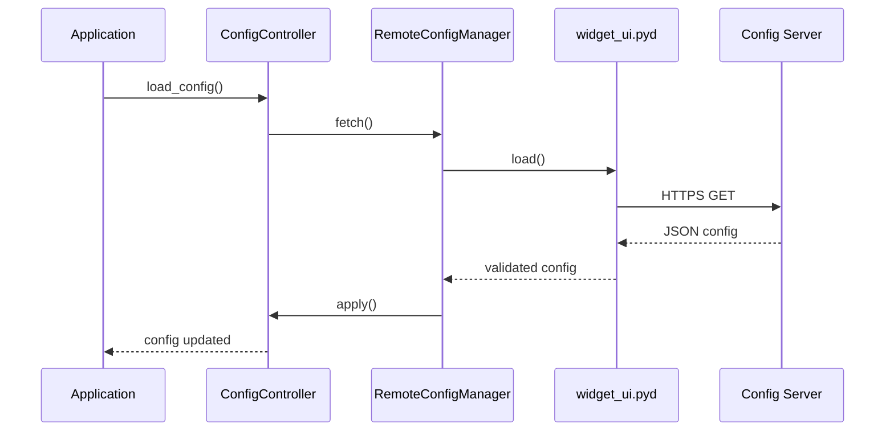

# Architecture Guide

This document describes the technical architecture of WSA Installer.

## System Overview

WSA Installer is a Python-based application with Rust native modules, designed to automate WSA installation and management on Windows.

```
┌──────────────────────────────────────────────────────────────┐
│                     WSA Installer v1.2.0                      │
├──────────────────────────────────────────────────────────────┤
│                                                              │
│  ┌─────────────┐    ┌──────────────────┐    ┌────────────┐  │
│  │  Flet GUI   │    │  InstallerLogic   │    │  Remote    │  │
│  │  (UI Layer) │◄──►│  (Core Engine)    │◄──►│  Config    │  │
│  └──────┬──────┘    └────────┬─────────┘    └────────────┘  │
│         │                    │                               │
│         ▼                    ▼                               │
│  ┌─────────────┐    ┌──────────────────┐                    │
│  │  5-Step     │    │  Rust Native     │                    │
│  │  Wizard     │    │  Modules (.pyd)  │                    │
│  │  Pages      │    └──────────────────┘                    │
│  └─────────────┘            │                               │
│                             ▼                               │
│  ┌─────────────┐    ┌──────────────────┐    ┌────────────┐  │
│  │  Embedded   │    │  Windows Service │    │  NSIS      │  │
│  │  Python 3.14│    │  (Background)    │    │  Installer │  │
│  └─────────────┘    └──────────────────┘    └────────────┘  │
│                                                              │
└──────────────────────────────────────────────────────────────┘
```

## Core Components

### 1. Flet GUI (UI Layer)

**File:** `app.py` — `main()` function (lines 6936-9044)

The GUI is built with Flet, a cross-platform UI framework. It provides:

- 5-step wizard interface
- Sidebar navigation
- Glass transparency (configurable alpha)
- Animated transitions
- Overlay dialogs

**Key Elements:**
- `ft.Stack` — Root container with overlays
- `title_bar` — Custom frameless window drag area
- `sidebar` — Step navigation with status indicators
- `content_area` — Dynamic content pages
- `bottom_bar` — Navigation buttons

### 2. InstallerLogic (Core Engine)

**File:** `app.py` — `InstallerLogic` class (lines 2431-5995)

The core engine handles all installation operations:

**Methods:**
- `download_asset()` — Parallel chunked download with resume
- `extract_7z()` — 7z archive extraction
- `install_wsa()` — 6-phase WSA installation
- `add_playStore()` — 7-phase Play Store integration
- `uninstall_wsa_logic()` — Complete WSA removal
- `_adb_connect_loop()` — ADB connection management
- `_automate_adb_authorization()` — UI automation for ADB popup

**State Dictionary:**
Contains 40+ keys tracking wizard state, progress, and UI updates.

### 3. ConfigController

**File:** `app.py` — `ConfigController` class (lines 1603-2036)

Manages application configuration with source tracking:

```
Default Config → Dev Mode Config → Server Config
```

**Features:**
- Source-tracked values
- Validation against allowed types/values
- Server-side updates via RemoteConfigManager

### 4. RemoteConfigManager

**File:** `app.py` — `RemoteConfigManager` class (lines 2154-2286)

Fetches and applies remote configuration:

**Process:**
1. Polls server JSON via `widget_ui.pyd`
2. Validates signature via Rust gateway
3. Applies configuration changes
4. Hash-based deduplication

### 5. Background Service

**File:** `app.py` — `WSABackgroundService` (lines 777-1598)

Windows Service running in SYSTEM context:

**Capabilities:**
- WSA port monitoring (58526)
- SDK lifecycle management
- User session process spawning via `CreateProcessAsUserW`
- Auto-restart on failure

### 6. Native Modules

| Module | Language | Purpose |
|:-------|:---------|:--------|
| `widget_ui.pyd` | Rust | Zero-trust config gateway |
| `playstore_patcher_mem.pyd` | Rust | Play Store patcher SDK |

## Security Architecture

```
┌──────────────────────────────────────────────────────┐
│                  Security Layers                      │
├──────────────────────────────────────────────────────┤
│                                                      │
│  Layer 1: widget_ui.pyd (Rust)                      │
│  ├── Zero-trust config gateway                      │
│  ├── Signature verification                         │
│  └── Encrypted config parsing                       │
│                                                      │
│  Layer 2: Socket-based Instance Locks               │
│  ├── Single instance enforcement                    │
│  └── Port-based process detection                   │
│                                                      │
│  Layer 3: Windows Service                           │
│  ├── SYSTEM-level service                           │
│  ├── Auto-restart on failure                        │
│  └── User session process spawning                  │
│                                                      │
│  Layer 4: Source Protection                         │
│  ├── Nuitka compilation                             │
│  ├── PyInstaller bundling                           │
│  └── Binary string obfuscation                      │
│                                                      │
└──────────────────────────────────────────────────────┘
```

## Build Pipeline

### Primary Build (build.bat)

```
Step 1: Clean
    └── Removes dist/, build/, app.pyd

Step 2: Dependencies
    └── pip install -r requirements.txt

Step 3: Version Update
    └── PowerShell replaces version in app.py + file_version_info.txt

Step 4: Nuitka Module
    ├── Compiles app.py → app.pyd (source protection)
    └── Renames app.py → wsa.py to hide source

Step 5: PyInstaller Onedir
    ├── Uses WSA_Installer_Download_onedir.spec
    └── Restores app.py from wsa.py

Step 6: WSARepair.exe
    └── PyInstaller --onefile

Step 7: Flet Client Patch
    ├── Patches flet.exe icon + version info
    └── Creates patched flet-windows.zip

Step 8: NSIS Installer
    └── Builds WSA_Installer_Setup.exe
```

## Data Flow

### Installation Flow



### Configuration Flow



## File Structure

```
wsa-installer/
├── app.py                    # Main application (~11K lines)
├── run.py                    # Entry point
├── WSARepair.py              # Windows Settings proxy
├── patch_flet.py             # Flet client patcher
├── launcher.cs               # C# launcher
│
├── assets/                   # Runtime resources
│   ├── adb.exe               # ADB binary
│   ├── AppxManifest.xml      # WSA manifest
│   ├── Run.bat               # MagiskOnWSALocal launcher
│   ├── settings.dat          # Pre-patched WSA settings
│   ├── WsaClient.exe         # Patched WSA client
│   └── icons/                # Application icons
│
├── native/                   # Rust native modules
│   ├── widget_ui.pyd         # Security gateway
│   └── playstore_patcher_mem.pyd  # Play Store SDK
│
├── emb_py/                   # Embedded Python 3.14
│   ├── python/               # CPython runtime
│   ├── PySide6/              # Qt6 bindings
│   └── requests/             # HTTP client
│
├── build/                    # Build scripts
│   ├── build.bat             # Primary build
│   ├── build2.bat            # Alternate build
│   └── WSA_Installer_Setup.nsi  # NSIS script
│
├── docs/                     # Documentation
└── tests/                    # Tests
```

## Performance Optimizations

### Parallel Downloads

- 30-chunk parallel download system
- HTTP Range headers for resume support
- Thread pool executor for concurrent requests

### Caching

- Download cache in `out_asset/cache/`
- Bundle detection avoids re-downloads
- Config hash deduplication

### Memory Management

- Streaming subprocess output
- Queue-based thread communication
- Lazy loading of heavy components

## Error Recovery

### Retry Logic

- ADB connection: 15 attempts with server restart
- Download resume: Partial file preservation
- Process kill: 3-attempt retry loops

### Fallback Mechanisms

- `CreateProcessAsUserW` → `Popen` fallback
- Server config → default config fallback
- Bundle → GitHub download fallback

### Logging

- Activity log: `wsa_activity.log`
- Debug log: `debug.log`
- UI log box in all dialogs
