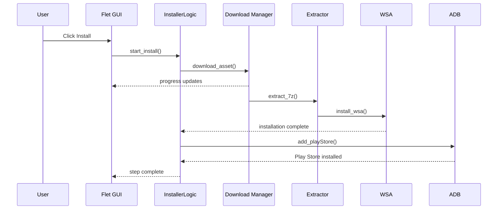
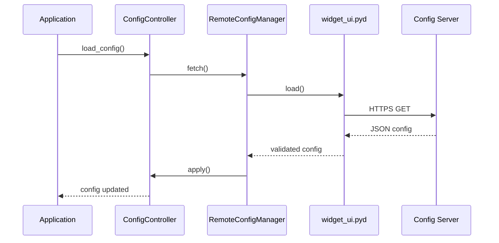

# Architecture Guide

This document describes the technical architecture of WSA Installer.

## System Overview

WSA Installer is a Python-based application with Rust native modules, designed to automate WSA installation and management on Windows.

```
┌──────────────────────────────────────────────────────────────────┐
│                   WSA Installer v1.2.0 (Download Edition)        │
├──────────────────────────────────────────────────────────────────┤
│                                                                  │
│  ┌─────────────┐    ┌──────────────────┐    ┌────────────┐      │
│  │  Flet GUI   │    │  InstallerLogic   │    │  Remote    │      │
│  │  (UI Layer) │◄──►│  (Core Engine)    │◄──►│  Config    │      │
│  └──────┬──────┘    └────────┬─────────┘    └────────────┘      │
│         │                    │                                   │
│         ▼                    ▼                                   │
│  ┌─────────────┐    ┌──────────────────┐                        │
│  │  5-Step     │    │  Rust Native     │    ┌────────────────┐  │
│  │  Wizard     │    │  Modules (.pyd)  │    │  WSA Pacman    │  │
│  │  + 3-Phase  │    └──────────────────┘    │  (APK Install) │  │
│  └─────────────┘            │               └────────────────┘  │
│                             ▼                                   │
│  ┌─────────────┐    ┌──────────────────┐    ┌────────────┐      │
│  │  Embedded   │    │  Windows Service │    │  NSIS      │      │
│  │  Python 3.14│    │  (Background)    │    │  Installer │      │
│  └─────────────┘    └──────────────────┘    └────────────┘      │
│                                                                  │
│  ┌─────────────────────────────────────────────────────────┐    │
│  │  APK Handler (ApkIconShlExt.dll) — Double-click Install │    │
│  └─────────────────────────────────────────────────────────┘    │
│                                                                  │
└──────────────────────────────────────────────────────────────────┘
```

## Core Components

### 1. Flet GUI (UI Layer)

**File:** `app.py` — `main()` function

The GUI is built with Flet, a cross-platform UI framework. It provides:

- 5-step wizard interface with 3-phase system check
- Sidebar navigation
- Glass transparency (configurable alpha)
- Animated transitions
- Overlay dialogs (download, restart, force-extract)

**Key Elements:**
- `ft.Stack` — Root container with overlays
- `title_bar` — Custom frameless window drag area
- `sidebar` — Step navigation with status indicators
- `content_area` — Dynamic content pages
- `bottom_bar` — Navigation buttons

### 2. InstallerLogic (Core Engine)

**File:** `app.py` — `InstallerLogic` class

The core engine handles all installation operations:

**Methods:**
- `_run_system_check()` — Phase 1: Windows version, virtualization, features
- `_run_bundle_check()` — Phase 2: Bundle detection, cache check, extraction
- `_apply_system_fixes()` — Phase 3: Virtualization bypass, registry fixes
- `download_asset()` — 30-chunk parallel download with resume
- `extract_7z()` — 7z archive extraction
- `install_wsa()` — 6-phase WSA installation
- `add_playStore()` — 7-phase Play Store integration
- `uninstall_wsa_logic()` — Complete WSA removal
- `_adb_connect_loop()` — ADB connection management
- `_automate_adb_authorization()` — UI automation for ADB popup
- `virtualization_bypass_for_wsa()` — System-level compatibility fixes

**State Dictionary:**
Contains 40+ keys tracking wizard state, progress, and UI updates.

### 3. WSA Pacman (APK Installer)

**File:** `app.py` — `wsa_pacman_install_app()` function

Double-click APK installer for WSA:

**Flow:**
1. Parse APK metadata (name, package, version, icon, size)
2. Check WSA installed and running
3. Connect ADB (15 attempts)
4. Detect install/update/downgrade/reinstall
5. Install via `adb install` or `adb install-multiple`
6. Create desktop shortcut with watermarked icon

**Supported formats:** `.apk`, `.xapk`, `.apks`, `.apkm`, `.aab`

### 4. APK File Handler

**File:** `app.py` — `_register_apk_handler()` / `_unregister_apk_handler()`

Windows Registry-based file association:

- Registers ProgIDs for 5 APK formats
- Sets open command: `app.py --wsa-pacman "%1"`
- Registers `ApkIconShlExt.dll` for per-file icons in Explorer
- Auto-registers on normal app startup

### 5. ConfigController

**File:** `app.py` — `ConfigController` class

Manages application configuration with source tracking:

```
Default Config → Dev Mode Config → Server Config
```

**Features:**
- Source-tracked values (knows where each config value came from)
- Validation against allowed types/values
- Server-side updates via RemoteConfigManager
- Hash-based deduplication

### 6. RemoteConfigManager

**File:** `app.py` — `RemoteConfigManager` class

Fetches and applies remote configuration:

**Process:**
1. Polls server JSON via `widget_ui.pyd`
2. Validates signature via Rust gateway
3. Applies configuration changes
4. Hash-based deduplication (skips unchanged configs)
5. Quick retry on failure (5s interval)

### 7. Background Service

**File:** `app.py` — `_run_bg_service_full()` function

Windows Service running in SYSTEM context:

**Capabilities:**
- WSA port monitoring (58526) — 1-second polling
- SDK lifecycle management via `CreateProcessAsUserW`
- File sharing auto-mount/unmount on WSA state change
- Remote config sync with hash dedup
- Auto-update check and dialog launch
- Single-instance lock (port 65433)

### 8. Native Modules

| Module | Language | Purpose |
|:-------|:---------|:--------|
| `widget_ui.pyd` | Rust | Zero-trust config gateway |
| `playstore_patcher_mem.pyd` | Rust | Play Store patcher SDK |
| `wsa_init.pyd` | Rust | WSA boot, ADB connect, WebDAV start |
| `wsa_net_provider.dll` | Rust | UNC-to-WebDAV network provider |
| `ApkIconShlExt.dll` | C++ | Per-file APK icons in Explorer |

## Security Architecture

```
┌──────────────────────────────────────────────────────┐
│                  Security Layers                      │
├──────────────────────────────────────────────────────┤
│                                                      │
│  Layer 1: widget_ui.pyd (Rust)                      │
│  ├── Zero-trust config gateway                      │
│  ├── Signature verification                         │
│  └── Encrypted config parsing                       │
│                                                      │
│  Layer 2: Socket-based Instance Locks               │
│  ├── Single instance enforcement                    │
│  └── Port-based process detection                   │
│                                                      │
│  Layer 3: Windows Service                           │
│  ├── SYSTEM-level service                           │
│  ├── Auto-restart on failure                        │
│  └── User session process spawning                  │
│                                                      │
│  Layer 4: Source Protection                         │
│  ├── Nuitka compilation                             │
│  ├── PyInstaller bundling                           │
│  └── Binary string obfuscation                      │
│                                                      │
└──────────────────────────────────────────────────────┘
```

## Build Pipeline

### Primary Build (build.bat)

```
Step 1: Clean
    └── Removes dist/, build/, app.pyd

Step 2: Dependencies
    └── pip install -r requirements.txt

Step 3: Version Update
    └── PowerShell replaces version in app.py + file_version_info.txt

Step 4: Nuitka Module
    ├── Compiles app.py → app.pyd (source protection)
    └── Renames app.py → wsa.py to hide source

Step 5: PyInstaller Onedir
    ├── Uses WSA_Installer_Download_onedir.spec
    └── Restores app.py from wsa.py

Step 6: WSARepair.exe
    └── PyInstaller --onefile

Step 7: Flet Client Patch
    ├── Patches flet.exe icon + version info
    └── Creates patched flet-windows.zip

Step 8: NSIS Installer
    └── Builds WSA_Installer_Setup.exe
```

## Data Flow

### Installation Flow


```mermaid
sequenceDiagram
    participant User
    participant GUI as Flet GUI
    participant IL as InstallerLogic
    participant DL as Download Manager
    participant EXT as Extractor
    participant WSA as WSA
    participant ADB as ADB

    User->>GUI: Click Install
    GUI->>IL: start_install()
    IL->>DL: download_asset()
    DL-->>GUI: progress updates
    DL->>EXT: extract_7z()
    EXT->>WSA: install_wsa()
    WSA-->>IL: installation complete
    IL->>ADB: add_playStore()
    ADB-->>IL: Play Store installed
    IL-->>GUI: step complete
```

### Configuration Flow


```mermaid
sequenceDiagram
    participant App as Application
    participant CC as ConfigController
    participant RCM as RemoteConfigManager
    participant WU as widget_ui.pyd
    participant Server as Config Server

    App->>CC: load_config()
    CC->>RCM: fetch()
    RCM->>WU: load()
    WU->>Server: HTTPS GET
    Server-->>WU: JSON config
    WU-->>RCM: validated config
    RCM->>CC: apply()
    CC-->>App: config updated
```

## File Structure

```
wsa-installer/
├── app.py                    # Main application (~12.6K lines)
├── run.py                    # Entry point
├── WSARepair.py              # Windows Settings proxy
├── patch_flet.py             # Flet client patcher
├── launcher.cs               # C# launcher
│
├── assets/                   # Runtime resources
│   ├── adb.exe               # ADB binary
│   ├── AppxManifest.xml      # WSA manifest
│   ├── Run.bat               # MagiskOnWSALocal launcher
│   ├── settings.dat          # Pre-patched WSA settings
│   ├── WsaClient.exe         # Patched WSA client (crash fix)
│   ├── ApkIconShlExt.dll     # C++ APK icon shell extension
│   ├── wsa-webdav.apk        # WebDAV server APK
│   ├── icon.ico              # Application icon
│   ├── ps.ico                # Play Store icon
│   └── aap++/                # Android APK analysis tools
│
├── native/                   # Rust native modules
│   ├── widget_ui.pyd         # Security gateway
│   └── playstore_patcher_mem.pyd  # Play Store SDK
│
├── net_provider/             # Rust network provider
│   ├── src/lib.rs            # UNC-to-WebDAV translation
│   ├── wsa_init.py           # WSA boot script
│   └── Cargo.toml            # Rust project config
│
├── shell_ext/                # C++ APK shell extension
│   ├── ApkIconShlExt.cpp     # Per-file APK icons
│   └── build_shell_ext.bat   # Build script
│
├── emb_py/                   # Embedded Python 3.14
│   ├── python/               # CPython runtime
│   ├── widget_ui.pyd         # Security gateway
│   ├── ads_sdk.pyd           # Ads SDK
│   ├── PySide6/              # Qt6 bindings
│   └── requests/             # HTTP client
│
├── scripts/                  # Build/utility scripts
│   ├── compress_internal.py  # Ultra-7z compression
│   ├── bundle_info.md        # Bundle documentation
│   └── download_bundle_gui.ps1  # GUI bundle downloader
│
├── build/                    # Build scripts
│   ├── build.bat             # Primary build
│   ├── build2.bat            # Alternate build
│   └── WSA_Installer_Setup.nsi  # NSIS script
│
├── docs/                     # Documentation
│   ├── flow.md               # Complete user flow guide
│   ├── installer.md          # Full feature documentation
│   ├── architecture.md       # This file
│   ├── cli-reference.md      # CLI arguments
│   ├── installation.md       # Installation guide
│   ├── webdav.md             # File sharing guide
│   ├── troubleshooting.md    # Common issues
│   ├── developer-guide.md    # Contributing guide
│   ├── adb.md                # ADB reference
│   └── repair.md             # Repair guide
│
└── tests/                    # Tests
```

## Performance Optimizations

### Parallel Downloads

- 30-chunk parallel download system
- HTTP Range headers for resume support
- Thread pool executor for concurrent requests

### Caching

- Download cache in `out_asset/cache/`
- Bundle detection avoids re-downloads
- Config hash deduplication

### Memory Management

- Streaming subprocess output
- Queue-based thread communication
- Lazy loading of heavy components

## Error Recovery

### Retry Logic

- ADB connection: 15 attempts with server restart
- Download resume: Partial file preservation
- Process kill: 3-attempt retry loops

### Fallback Mechanisms

- `CreateProcessAsUserW` → `Popen` fallback
- Server config → default config fallback
- Bundle → GitHub download fallback

### Logging

- Activity log: `wsa_activity.log`
- Debug log: `debug.log`
- UI log box in all dialogs
